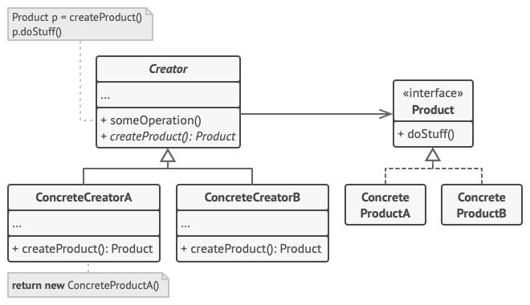
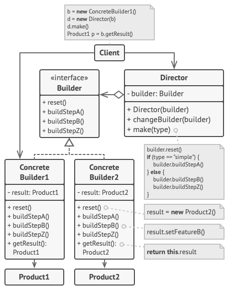

# Design Patterns

## Creational Patterns

### Factory Method

工厂方法模式
工厂方法将创建与使用代码分离，从而在不影响其他代码下扩展
扩展软件或组件时，使用工厂方法就非常便利了，如继承Button类，自定义功能就是重写部分方法
这些方法的特征是
1，所有创建都遵循同一接口，该接口对所有创建者都有意义
2，在创建factory中添加一个方法，返回类型遵循同一接口
3，使用抽象声明和继承技术
 
优势：
1，创建与实现分离，降低耦合性
2，单一职责原则，便于维护实现部分
3，开闭原则，
 
劣势：
1，工厂产品过多，即创建类别过多，重复逻辑也很重，代码结构臃肿

### Abstract Factory

抽象工厂模式
相比工厂方法模式，抽象工厂粒度更大，控制精度也就弱了，是对工厂进行抽象，工厂方法是针对一个产品，
抽象工厂是对多个产品的更高层次的抽离，比如GUI，不同平台都有相同的UI概念，但
业务代码只需要UI概念，不需要考虑平台在UI上的概念
 
优势：
与工厂方法类型
 
劣势：
因为更宏大，有多个产品，代码相比更复杂，相同逻辑重叠较高

### Builder

生成器模式
生成器模式就是参数很多，但是具体的实体可能就是部分参数，即可定制化配置参数的应用场景
把这些参数抽象剥离对象的构造函数的过程就是生成器模式
如果把这些参数外包给第三方，就是主管Director的作用了，实现还是由生成器来完成，主管来
定义这些参数的决定权

### Prototype

原型模式将克隆过程委托给被克隆对象，即把公共部分抽离为对象，对象提供了clone方法对外一致性的接口。EMCAScript中的代码就有非常多的这种用法，
一致性的接口避免了调用克隆者与克隆对象的耦合性，克隆对象就是原型，这与子类的区别就是降低了耦合性，把耦合性扁平化了，并没有形成更复杂的层级关系

原型注册表prototype registry提供了一种访问常用原型的简单方法，缓存了一系列可供随时复制的预生成对象

### Singleton

单例模式，一个类仅提供一个实例，算是一个类的全局实例对象
一些类控制着资源，需要共享，且有访问限制，就需要保证只有一个实例
劣势：
违背了单一职责原则

## Structural Patterns

## Behavioral Patterns